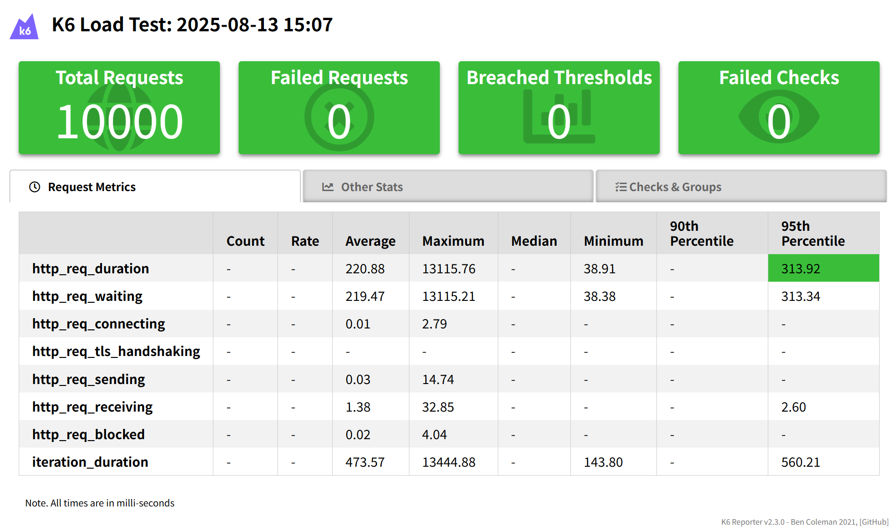
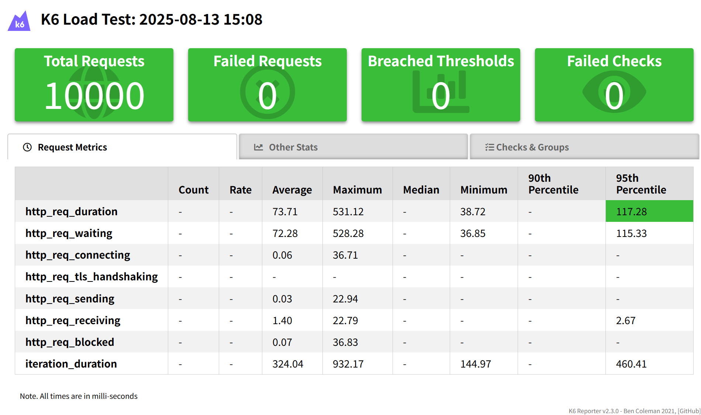

## 📊 성능 테스트 결과 (S3 Presigned URL Redis 캐싱 전/후)

### 테스트 개요

* **대상 API**: 그룹 목록 조회 (`/api/groups/on?sort=LATEST&page={n}`)
* **데이터 규모**: 온라인 모임 10,000건
* **부하 조건**: 50 VUs, 총 10,000 요청
* **비교 방식**:

  * **Cold Run**: Redis 캐시 미적용 (Presigned URL 실시간 생성)
  * **Warm Run**: Redis 캐시 적용 (Presigned URL 재사용)

 

### 성능 지표 비교

| 구분                   | 평균 응답시간 (ms) | 95th Percentile (ms) | 최대 응답시간 (ms) | 총 소요 시간 (초) |
| -------------------- | -----------: | -------------------: | -----------: | ----------: |
| **Cold Run (캐시 없음)** |       220.88 |               313.92 |     13115.76 |       94.95 |
| **Warm Run (캐시 적용)** |        73.71 |               117.28 |       531.12 |       65.06 |
| **개선율**              |  **↓ 66.6%** |          **↓ 62.6%** |  **↓ 95.9%** | **↓ 31.4%** |

 

### 주요 개선 포인트

* **Presigned URL Redis 캐싱** 적용 시 평균 응답시간이 **220.88 → 73.71 ms**로 **66.6% 단축**
* P95(상위 5% 응답시간)가 **313.92 → 117.28 ms**로 **62.6% 단축**
* 최대 응답시간이 **13.1초 → 0.53초**로 **95.9% 감소**, 이상 지연 제거 효과 큼
* 전체 테스트 소요 시간 약 **31% 감소**, 처리 효율 및 안정성 모두 향상

 

### 시각 자료

#### 📉 캐싱 전 (Cold Run)

#### 🚀 캐싱 후 (Warm Run)

